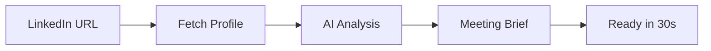
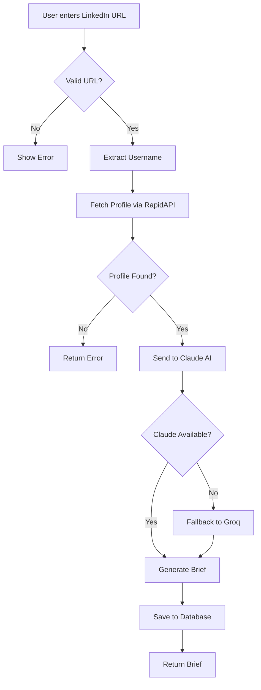
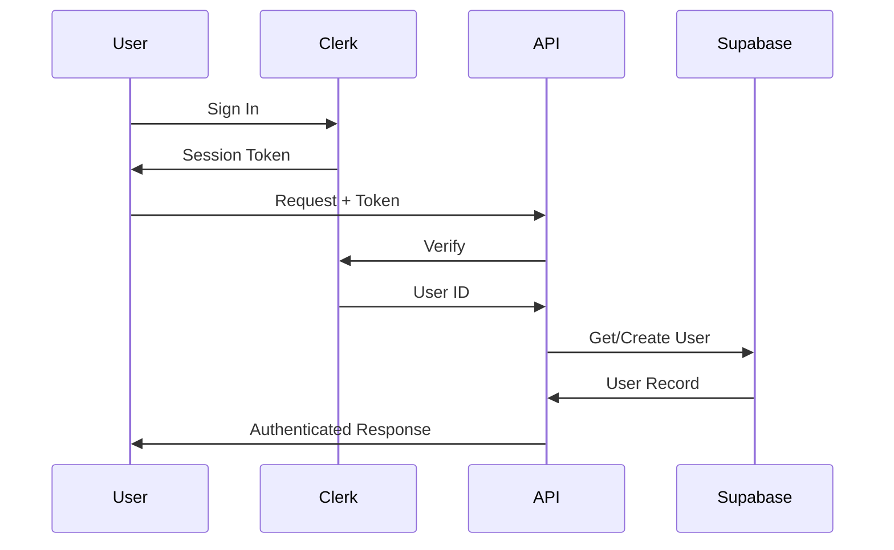
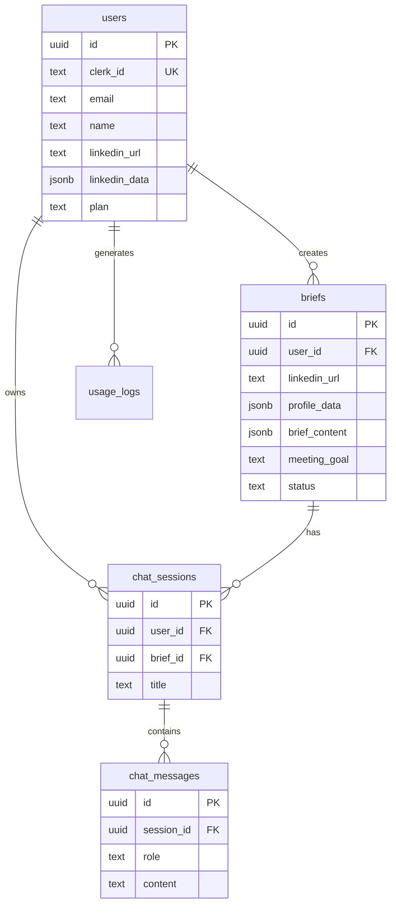

# Prereq


**Know anyone in 30 seconds.** AI-powered meeting preparation that transforms LinkedIn profiles into actionable intelligence briefs.

[](https://prereq.brianmwai.com)
[](https://nextjs.org/)
[](https://www.typescriptlang.org/)
[](https://anthropic.com/)

---

## Quick Links

| Resource | Link |
|----------|------|
| **Live App** | [prereq.brianmwai.com](https://prereq.brianmwai.com) |
| **Privacy Policy** | [prereq.brianmwai.com/privacy](https://prereq.brianmwai.com/privacy) |
| **Terms of Service** | [prereq.brianmwai.com/terms](https://prereq.brianmwai.com/terms) |
| **Cookie Policy** | [prereq.brianmwai.com/cookies](https://prereq.brianmwai.com/cookies) |
| **Support** | [prereq.brianmwai.com/support](https://prereq.brianmwai.com/support) |
| **Contact** | support@brianmwai.com |

---

## What It Does

Paste a LinkedIn URL. Get back:

- **Summary** - Who they are in 2-3 sentences
- **Talking Points** - Topics that actually matter
- **Common Ground** - Shared interests/experiences
- **Icebreakers** - Conversation starters that work
- **Questions to Ask** - Smart, relevant questions
- **Meeting Strategy** - How to approach the conversation

Also includes: Chrome extension for one-click briefs directly on LinkedIn.

---

## How It Works



### Brief Generation Flow



### Authentication Flow



---

## Tech Stack

### Core

| Technology | Purpose |
|------------|---------|
| **Next.js 15** | React framework with App Router |
| **TypeScript** | Type safety |
| **Tailwind CSS** | Styling |
| **Supabase** | PostgreSQL database |
| **Clerk** | Authentication |

### AI

| Provider | Model | Role |
|----------|-------|------|
| **Anthropic** | Claude 3.5 Sonnet | Primary AI |
| **Groq** | Llama 3.3 70B | Fallback |

### Extension

| Component | Purpose |
|-----------|---------|
| **Manifest V3** | Modern Chrome extension |
| **Service Worker** | Background processing |
| **Side Panel** | Brief display |

---

## Meeting Goals

Choose your objective. Get tailored insights.

| Goal | Focus Areas |
|------|-------------|
| **Networking** | Shared interests, genuine connections |
| **Sales** | Pain points, decision process, value angles |
| **Hiring** | Culture fit, career trajectory, motivations |
| **Investor** | Thesis, portfolio, key metrics |
| **Partner** | Mutual value, synergies, trust points |
| **General** | Professional rapport, common ground |

---

## Project Structure

```
prereq/
├── src/
│   ├── app/
│   │   ├── (marketing)/        # Landing, legal pages
│   │   ├── dashboard/          # Protected routes
│   │   │   ├── briefs/         # Brief management
│   │   │   └── sage/           # AI assistant
│   │   └── api/                # API routes
│   │       ├── briefs/         # CRUD + generate
│   │       ├── chat/           # Sage AI
│   │       └── user/           # Profile management
│   ├── components/             # React components
│   ├── lib/                    # Utilities
│   │   ├── ai/                 # Claude + Groq clients
│   │   ├── supabase/           # Database client
│   │   └── linkedin/           # Profile fetcher
│   └── types/                  # TypeScript types
├── extension/                  # Chrome Extension
│   ├── manifest.json
│   ├── background/             # Service worker
│   ├── content/                # LinkedIn injection
│   ├── sidepanel/              # Brief display
│   └── popup/                  # Quick actions
└── public/                     # Static assets
```

---

## API Reference

### Endpoints

| Method | Endpoint | Description |
|--------|----------|-------------|
| `POST` | `/api/briefs/generate` | Generate brief from LinkedIn URL |
| `GET` | `/api/briefs` | List all briefs |
| `GET` | `/api/briefs/[id]` | Get single brief |
| `PATCH` | `/api/briefs/[id]` | Update brief |
| `DELETE` | `/api/briefs/[id]` | Delete brief |
| `POST` | `/api/briefs/[id]/refresh` | Regenerate brief |
| `POST` | `/api/chat/[briefId]` | Chat with Sage AI |
| `GET` | `/api/stats` | Usage statistics |
| `GET` | `/api/health` | Health check |

### Authentication

All endpoints require authentication via:
- **Cookie-based**: Automatic for browser
- **Bearer token**: `Authorization: Bearer <token>`

### Generate Brief

```bash
POST /api/briefs/generate
Content-Type: application/json

{
  "linkedin_url": "https://linkedin.com/in/username",
  "meeting_goal": "sales"
}
```

Response:
```json
{
  "brief": {
    "id": "uuid",
    "profile_data": { "name": "...", "headline": "..." },
    "brief_content": {
      "summary": "...",
      "talking_points": ["..."],
      "questions_to_ask": ["..."],
      "ice_breakers": ["..."]
    }
  }
}
```

---

## Database Schema



---

## Setup

### Prerequisites

- Node.js 18+
- Supabase account
- Clerk account
- Anthropic API key
- RapidAPI key (LinkedIn)

### Installation

```bash
# Clone
git clone https://github.com/brn-mwai/prereq-codecraze.git
cd prereq-codecraze

# Install
npm install

# Configure
cp .env.example .env.local
# Fill in environment variables

# Run
npm run dev
```

### Environment Variables

| Variable | Required | Description |
|----------|----------|-------------|
| `NEXT_PUBLIC_CLERK_PUBLISHABLE_KEY` | Yes | Clerk public key |
| `CLERK_SECRET_KEY` | Yes | Clerk secret key |
| `CLERK_WEBHOOK_SECRET` | Yes | Webhook verification |
| `NEXT_PUBLIC_SUPABASE_URL` | Yes | Supabase URL |
| `NEXT_PUBLIC_SUPABASE_ANON_KEY` | Yes | Supabase anon key |
| `SUPABASE_SERVICE_ROLE_KEY` | Yes | Supabase service key |
| `ANTHROPIC_API_KEY` | Yes | Claude API key |
| `GROQ_API_KEY` | No | Fallback AI |
| `RAPIDAPI_KEY` | Yes | LinkedIn data |

---

## Chrome Extension

### Install from Source

1. Go to `chrome://extensions/`
2. Enable "Developer mode"
3. Click "Load unpacked"
4. Select the `extension/` folder

### Features

- Floating button on LinkedIn profiles
- Side panel for viewing briefs
- Auto-authentication with web app
- Offline brief caching

### Permissions

| Permission | Reason |
|------------|--------|
| `activeTab` | Access LinkedIn page |
| `storage` | Cache briefs locally |
| `sidePanel` | Display briefs |
| `scripting` | Inject content scripts |

---

## Sage AI Assistant

Interactive AI chat for deeper meeting prep.

### Capabilities

- Answer questions about target person
- Suggest meeting strategies
- Generate email/DM templates
- Find common ground
- Role-play conversations

### Animated Interface

Rive-powered orb with states: idle, listening, thinking, speaking.

---

## Deployment

### Vercel

```bash
vercel --prod
```

### Checklist

- [ ] Set all environment variables
- [ ] Configure Clerk webhook endpoint
- [ ] Verify Supabase connection
- [ ] Test LinkedIn profile fetching
- [ ] Test extension auth flow

---

## Plans & Limits

| Plan | Briefs/Month | Features |
|------|--------------|----------|
| **Free** | 10 | Basic briefs |
| **Starter** | 50 | + Meeting goals |
| **Pro** | Unlimited | + Sage AI, priority support |

---

## Author

**Brian Mwai**
Physics Major | Software Engineer

- Website: [brianmwai.com](https://brianmwai.com)
- Email: support@brianmwai.com

---

## License

Proprietary. All rights reserved.

---

## Support

Having issues? Check our [Support Center](https://prereq.brianmwai.com/support) or email support@brianmwai.com.

Response time: within 24 hours.

---

*Know anyone in 30 seconds.*
